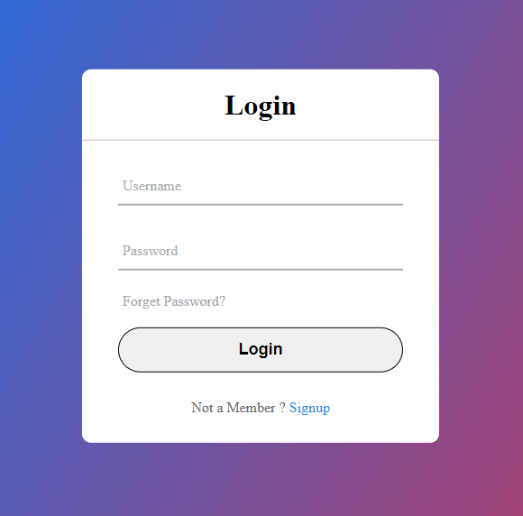

# Практики по предмету Специальное программное обеспечение реального времени

### Практика № 1

Добавлены упражнения по языку JavaScript [practice1](./practice1/).

### Практика № 2

Добавлены упражнения по верстке страницы Регистрации пользователей [practice2](./practice2/).

Пример интерфейса: 

